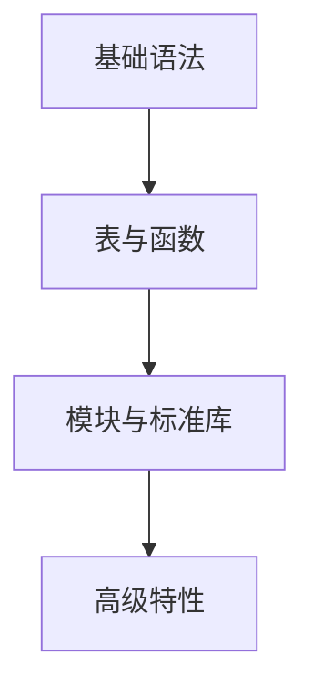

游戏引擎版本：`Lua_v5.1 + Love2d_v10.2 + LuaJIT_v2.0.4`

### 1.1 什么是 Lua？

**Lua**是一种轻量级、高效、可嵌入的脚本语言。它诞生于 1993 年，由巴西里约热内卢天主教大学（PUC-Rio）的 TeCGraf 实验室开发。

#### Lua 的设计哲学
简单、小巧、高效、可嵌入、可扩展

如果说 C/C++、Java 这样的语言是"工业级重型机械"，那么 Lua 就像是"瑞士军刀"——小巧灵活，适合嵌入到其他系统中，为大型程序添加脚本能力。

### 1.2 Lua 的核心特点

#### 1. 轻量级
- **体积小巧**：Lua 5.1 解释器仅约 200KB（编译后）
- **资源占用少**：内存占用小，启动速度快
- **代码简洁**：整个 Lua 语言规范用几页纸就能描述清楚

#### 2. 可嵌入性
这是 Lua 最重要的特性之一。你可以将 Lua 嵌入到 C/C++、Java、C#、Python 等程序中，让这些程序获得脚本扩展能力。

**示例场景**：
```
游戏引擎（主程序，C++编写）
    ↓
嵌入Lua解释器
    ↓
用Lua编写游戏逻辑、AI行为、任务系统
    ↓
无需重新编译主程序即可修改游戏内容
```

#### 3. 高效
- Lua 的解释器非常高效
- 执行速度通常比其他脚本语言快
- 具有自动内存管理（垃圾回收）

#### 4. 简单而强大
Lua 语法简单，但功能强大。它使用**表（table）**作为唯一的数据结构机制，通过这一种结构实现了数组、字典、对象、模块等多种功能。

### 1.3 Lua 5.1 的特殊地位

#### 为什么选择 Lua 5.1？
Lua 5.1 发布于 2006 年，虽然现在已有更新的版本（5.2、5.3、5.4），但 5.1 版本仍然是：
1. **最广泛使用的版本**：大量现有项目基于 5.1
2. **最稳定的版本**：经过多年实践检验
3. **兼容性最好**：与各种中间件、引擎兼容性最佳

#### 主要应用领域
| 领域 | 具体应用 | 代表产品 |
|------|----------|----------|
| **游戏开发** | 游戏逻辑、UI、配置 | World of Warcraft, Angry Birds, Civilization |
| **嵌入式系统** | 路由器、工业控制 | Redis, Nginx+Lua, HAProxy |
| **应用程序** | 插件系统、自动化 | Adobe Lightroom, Wireshark, VLC |
| **Web 开发** | 服务器端脚本 | OpenResty, Lapis |

### 1.4 Lua 与其他语言的对比
**Python**：
```python
def greet(name):
    print(f"Hello, {name}!")

greet("World")
```

**JavaScript**：
```javascript
function greet(name) {
    console.log(`Hello, ${name}!`);
}

greet("World");
```

**Lua 5.1**：
```lua
function greet(name)
    print("Hello, " .. name .. "!")
end

greet("World")
```

Lua 的语法更加简洁，没有花括号，使用 `function` 和 `end` 来界定函数体，使用 `..` 来连接字符串。

### 1.5 Lua 语言的"世界观"

在学习 Lua 之前，理解它的几个核心理念很重要：

#### 1. 一切皆值
在 Lua 中，所有值都是"一等公民"——函数可以存储在变量中，作为参数传递，作为返回值。

#### 2. **表的万能性**
表（table）是 Lua 中唯一的数据结构，但通过它你可以实现：
- 数组（列表）
- 字典（映射）
- 对象（通过表+函数）
- 模块
- 包

#### 3. 少即是多
Lua 语言本身只有很少的关键字（约 20 个），标准库也很精简，但通过这种简洁性获得了极大的灵活性和可扩展性。

### 1.6 谁在使用 Lua？
1. **游戏领域**：
	- 《魔兽世界》：用户界面和插件系统
	- 《愤怒的小鸟》：游戏逻辑
	- 《文明》系列：AI 和游戏规则

2. **软件领域**：
	- Redis：支持 Lua 脚本执行
	- Nginx：通过 OpenResty 支持 Lua
	- Wireshark：协议分析脚本

3. **工业领域**：
	- 思科路由器：配置和自动化
	- 医疗设备：控制逻辑

### 1.7 学习路线图

作为零基础学习者，你的学习路径将是：



### 1.8 常见误解澄清

在开始学习前，让我们澄清一些常见误解：

1. **"Lua 只是玩具语言"** ❌
   事实：Lua 被用于许多关键系统，性能优异，功能完整。

2. **"Lua 功能太弱"** ❌
   事实：Lua 通过 C API 可以轻松扩展，理论上可以实现任何功能。

3. **"Lua 只适合游戏"** ❌
   事实：Lua 在嵌入式、网络、工具等领域都有广泛应用。

4. **"学习 Lua 没什么用"** ❌
   事实：Lua 让你理解"简洁设计"的价值，这种思想适用于所有编程领域。

## 1.9 本章总结

### 关键知识点回顾
- Lua 是轻量级、可嵌入的脚本语言
- Lua 5.1 是最稳定、应用最广泛的版本
- Lua 的核心特点是简洁、高效、灵活
- 表（table）是 Lua 中最重要的数据结构
- Lua 在游戏、嵌入式、网络等领域有广泛应用

### 思考题
1. 根据你的了解，Lua 最适合解决什么类型的问题？
2. 为什么许多游戏选择 Lua 作为脚本语言，而不是直接使用 C++？
3. 你觉得 Lua 的"简洁设计"理念有什么优点和缺点？

---

**下一章预告**：在第 2 章中，我们将学习基础语法规则，这是写出高质量代码的关键！
